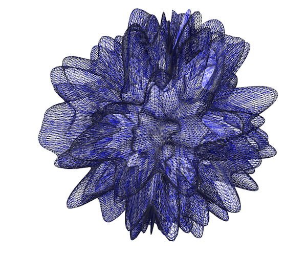

##Week 10 Homework: Meshes and 3D Drawing

###Notes
[Making Geometries](https://gist.github.com/patriciogonzalezvivo/5473484) by Patricio Gonzalez Vivo.

### Read

* [Chapter 7: Drawing in 3D - Using ofMesh](http://gcc.bradley.edu/faculty/nelson-matt/IM460/Mastering%20openFrameworks-%20Creative%20Coding%20Demystified%20%5BeBook%5D.pdf) in Mastering openFrameworks: Creative Coding Deymistified. Note here are the code examples from the book: [ofDemystified](https://github.com/firmread/ofDemystified)

* [Introducing OpenGL for OF](http://openframeworks.cc/ofBook/chapters/openGL.html) in ofBook.

* [Drawing Lines](http://openframeworks.cc/ofBook/chapters/lines.html) in ofBook.

* [Basics of Generating Meshes from an Image](http://openframeworks.cc/ofBook/chapters/generativemesh.html) in ofBook.

* Intro to ofFbo: [Multiple Textures](http://openframeworks.cc/ofBook/chapters/shaders.html#multipletextures) and [ofFbo](http://openframeworks.cc/ofBook/chapters/shaders.html#offbo) 

###Watch 

[Cylinder Mesh Example](https://vimeo.com/41297608) from Kyle McDonald. 

### Compile and Play

* [ofxMeshWarp](https://github.com/nariakiiwatani/ofxMeshWarp)
* [ofxWarpableMesh](https://github.com/neilmendoza/ofxWarpableMesh)
* [ofxTriangleMesh](http://github.com/ofZach/ofxTriangleMesh)
* [Spring-Mesh-Webcam](https://github.com/terrybroad/Spring-Mesh-Webcam/blob/master/openFrameworks-Info.plist)

###Code:

1. Using the example from class 'meshPlane' and the example from week 2 'Sphere', create the shape shown below.  

2. Using images or video create a fun app using 3D meshes. Add a GUI to modify the verticies and other parameters. 

3. **Final Assignement 1:**

	For your final you will create a simulation of a natural phenomenon and use algorithms to implement your ideas. You can think of this literally like modeling water or wind or you can think of this more abstractly like visualizing music or love. *[For 2nd years only: if you want to do something else related to your thesis, that is ok. Please just let me know that you are using this final project as a prototype for thesis.]*

	You need to have a solid concept. Come to class with a 3 slide presentation of 3 concepts for your final project. Each slide should describe what the natural phenomenon is and how you would implement it. The implementation should reflect your personal aesthetic and style. You will present these concepts in class and receive feedback from the class. *[Second years: if you are doing a thesis prototype, you need to only come to class with 1 slide that describes your concept and implementation plan.]* 

